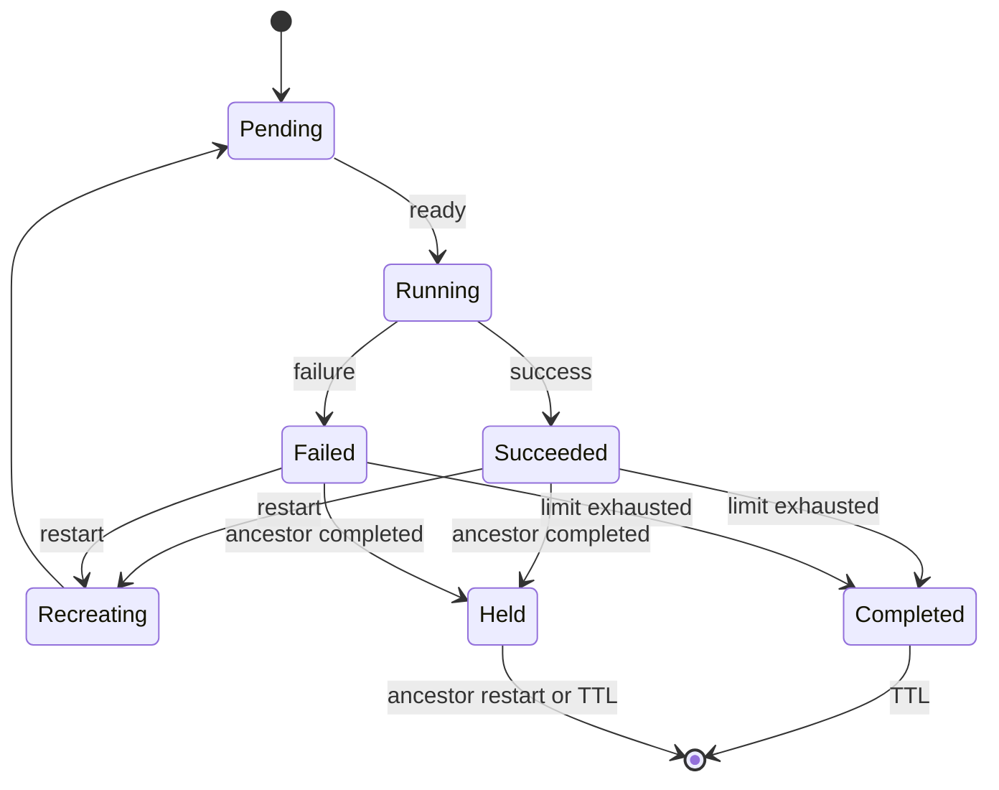
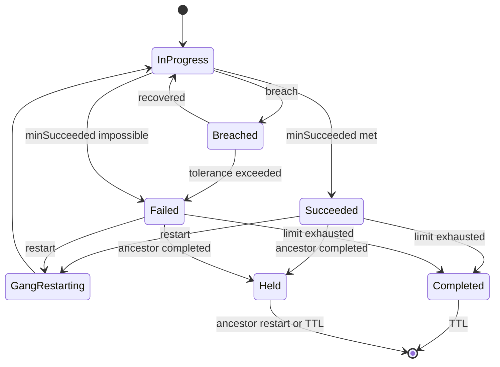
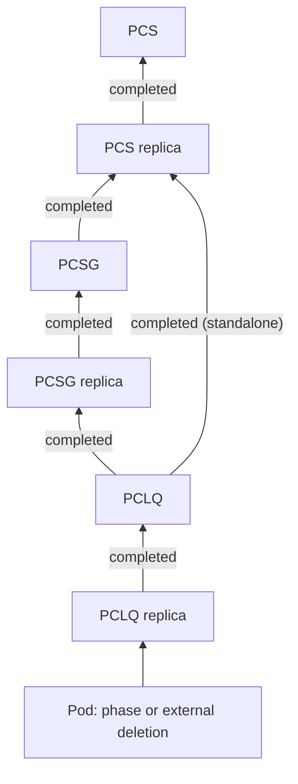
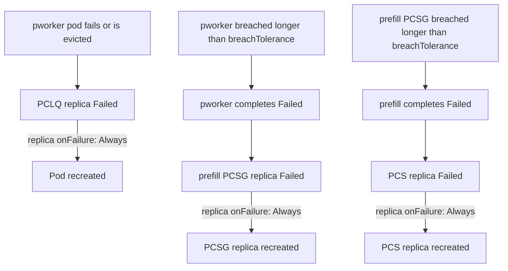
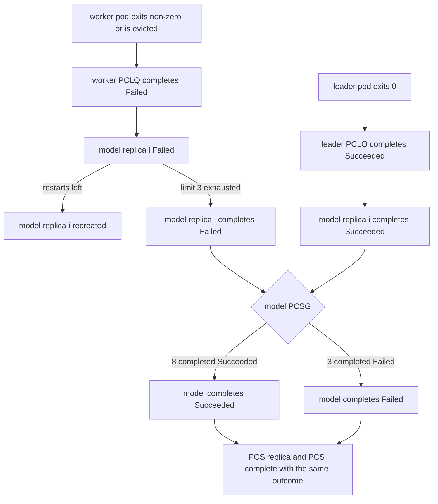

# GREP-0877: Terminal States, Termination and Restart Policies

<!-- toc -->
- [Summary](#summary)
- [Motivation](#motivation)
  - [Goals](#goals)
  - [Non-Goals](#non-goals)
- [Abbreviations](#abbreviations)
- [Proposal](#proposal)
  - [Resources, replicas and children](#resources-replicas-and-children)
  - [Terminal states and conditions](#terminal-states-and-conditions)
  - [Restarts and completion](#restarts-and-completion)
  - [Disaggregating MinAvailable](#disaggregating-minavailable)
  - [Long-running and completion-aware resources](#long-running-and-completion-aware-resources)
  - [User Stories](#user-stories)
    - [Story 1: Tolerate pod loss without re-gang-scheduling](#story-1-tolerate-pod-loss-without-re-gang-scheduling)
    - [Story 2: Distributed batch inference](#story-2-distributed-batch-inference)
    - [Story 3: Leader-driven completion](#story-3-leader-driven-completion)
    - [Story 4: Keeping a failed replica for inspection](#story-4-keeping-a-failed-replica-for-inspection)
    - [Story 5: Model warm-up before serving](#story-5-model-warm-up-before-serving)
  - [Limitations/Risks &amp; Mitigations](#limitationsrisks--mitigations)
- [Design Details](#design-details)
  - [Termination and restart rules](#termination-and-restart-rules)
  - [API changes](#api-changes)
  - [Status changes](#status-changes)
  - [Per-replica state](#per-replica-state)
  - [Pod deletion attribution](#pod-deletion-attribution)
  - [Semantics clarified by this GREP](#semantics-clarified-by-this-grep)
  - [Defaults](#defaults)
  - [Validation](#validation)
  - [Replica state machine](#replica-state-machine)
  - [Resource state machine](#resource-state-machine)
  - [Propagation and evaluation](#propagation-and-evaluation)
  - [Long-running lifecycle](#long-running-lifecycle)
  - [Completion-aware lifecycle](#completion-aware-lifecycle)
  - [Mixed-mode resources](#mixed-mode-resources)
  - [Interaction with existing features](#interaction-with-existing-features)
  - [Migration from legacy fields](#migration-from-legacy-fields)
  - [Update policy defaults](#update-policy-defaults)
  - [Open Questions](#open-questions)
  - [Monitoring](#monitoring)
  - [Dependencies](#dependencies)
  - [Test Plan](#test-plan)
- [Alternatives](#alternatives)
- [Appendix](#appendix)
<!-- /toc -->

## Summary

Grove today treats every workload as long-running: pods are always restarted, a Grove resource never "finishes", and the only failure response is a hard-coded gang termination of a whole PodCliqueSet replica after a breach of `MinAvailable`. This GREP gives every Grove resource (PodCliqueSet, PodCliqueScalingGroup and PodClique) and every replica of those resources two well-defined terminal states, **Succeeded** and **Failed**, together with declarative policies that decide when a resource or replica reaches them and whether Grove restarts it afterwards. It also splits the overloaded `MinAvailable` field into three purpose-specific knobs — one for gang scheduling, one for rolling updates and one for availability — so that each can be tuned independently. The result is a single API that handles both long-running inference services and completion-aware workloads (batch inference, evaluation, data preparation) with explicit, observable lifecycle semantics.

## Motivation

`MinAvailable` currently carries three unrelated responsibilities:

- it sets the gang-scheduling minimum (`PodGroup.minReplicas` and the Anchor/Tail split of the PodGangMap);
- it sets the size of the Minimum Viable Unit in a Coherent update;
- it is the threshold for the `MinAvailableBreached` condition that drives gang termination.

Because the field is immutable and shared, users cannot, for example, gang-schedule a full 8-pod tensor-parallel group while tolerating the loss of one pod at runtime, or roll updates in larger units than the availability floor.

Termination and restart behaviour is likewise implicit and fixed:

- **Pods can never complete.** The PodCliqueSet validating webhook forces `podSpec.restartPolicy` to `Always`, so Grove cannot run completion-aware workloads.
- **Gang termination is hard-wired.** A breached PodClique or PodCliqueScalingGroup (PCSG) recycles a PCSG replica or the whole PodCliqueSet (PCS) replica after a single global `terminationDelay` (default 4h). There is no way to opt out, cap the number of restarts, or choose which component failures matter.
- **No Grove resource reports a terminal state.** The `PodGangFailed` and `PodGangSucceeded` phases exist in the API, but nothing drives them. Tools built on Grove (for example Dynamo, Kueue or a CI system) cannot tell whether a workload finished, failed permanently, or is still being retried.

Kubernetes defines these semantics for containers (exit code), pods (`restartPolicy`) and Jobs (`successPolicy`, `podFailurePolicy`, `backoffLimit`), but none of them compose across Grove's three-level hierarchy of PCS → PCSG → PodClique → Pod.

### Goals

- Define two logical terminal states, `Succeeded` and `Failed`, for every Grove resource and every replica of a Grove resource, and surface them as status conditions.
- Define a uniform termination policy on PCS, PCSG and PodClique with two scopes:
  - **Resource scope:** an availability policy (`MinAvailableBreached` plus a breach tolerance) for long-running resources, or a completion policy (`MinSucceededAchieved`) for completion-aware resources.
  - **Replica scope:** success and failure rules evaluated over the terminal states of the replica's children.
- Define resource-scope and replica-scope restart policies (`Always` or `Limit`, separately for success and failure) that apply only once the resource or replica is terminal, and a `Completed` signal that stops all restarts below a resource or replica whose restart limit is exhausted.
- Split `MinAvailable` into `init.minReplicas` (gang scheduling), `update.minReplicas` (minimum update unit) and `termination.resource.availability.minReplicas` (availability floor).
- Support completion-aware workloads by allowing `Never`/`OnFailure` pod restart policies.
- Let one PodCliqueSet mix long-running and completion-aware resources, for example a model warm-up PodClique inside a long-running inference service.
- Preserve today's behaviour for existing PodCliqueSets through defaulting and a documented mapping from the legacy fields.
- Keep completed replicas and resources inspectable for a configurable `ttlAfterFinished`, then free their capacity.
- Keep status size independent of the number of replicas.

### Non-Goals

- **Startup deadlines.** Detecting workloads that never become ready is out of scope. Breach evaluation starts only after a resource has been available at least once, and a startup timeout can be proposed separately.
- **Container-level restart policies or retry back-off inside a pod.** Kubernetes already handles these through the kubelet.
- **Container-targeted PodClique replica rules.** A PodClique replica's terminal state follows its pod's phase (rule 5b); see [Alternatives](#alternatives).
- **Suspend/resume, queueing and admission semantics.** These belong to the Kueue integration (GREP-704).
- **Autoscaling of completion-aware resources.** Completion-aware resources reject `autoScalingConfig`/`scaleConfig` in this GREP.
- **Deleting a completed resource itself.** `ttlAfterFinished` deletes a completed resource's children but keeps the resource object, so its terminal status stays observable. Deleting the PCS after completion is left to the user or to a higher-level controller.

## Abbreviations

| Abbreviation | Meaning |
|---|---|
| PCS | PodCliqueSet |
| PCSG | PodCliqueScalingGroup |
| PCLQ | PodClique |
| LR | Long-running (no completion policy) |
| CA | Completion-aware (a completion policy is set) |
| MVU | Minimum Viable (update) Unit, as defined in GREP-393 |

## Proposal

The behaviour proposed here is defined by a numbered set of [termination and restart rules](#termination-and-restart-rules) in Design Details. References such as "rule 4c.iii" point to those rules.

### Resources, replicas and children

Every Grove resource is made up of one or more replicas, and every replica is made up of children (rules 2c–2e, 5a, 6a and 7a):

| Resource | A replica is | Children of a replica | Parent resource / parent replica |
|---|---|---|---|
| PCS | One complete copy of the workload | Its standalone PCLQs and its PCSGs | — |
| PCSG | One group of member PCLQs | Those PCLQs | The PCS / the PCS replica |
| PCLQ (standalone) | One pod | The pod's containers | The PCS / the PCS replica |
| PCLQ (PCSG member) | One pod | The pod's containers | The PCSG / the PCSG replica |

The **ancestors** of a resource or replica are every resource and replica on the path from it to the PCS. For example, the ancestors of a pod of a PCSG member PCLQ are that PCLQ, its PCSG replica, the PCSG, its PCS replica and the PCS.

Two kinds of state are tracked at every level:

- **Replica state** is derived from the terminal states of the replica's children, using the replica **success** and **failure** policies. If both are satisfied, the failure policy takes precedence. A PCLQ replica's state follows its pod's phase directly (rule 5b).
- **Resource state** is derived from two conditions over its replicas:
  - `MinAvailableBreached`, from the availability policy;
  - `MinSucceededAchieved`, from the completion policy.

A resource's own terminal state is what its parent replica sees as a child `Succeeded` or `Failed`.

### Terminal states and conditions

Grove defines exactly two terminal states, `Succeeded` and `Failed`. A resource reports them through two new conditions:

| Condition | `True` | `False` | `Unknown` |
|---|---|---|---|
| `Succeeded` | Terminal state `Succeeded` | Terminal state `Failed` | Not terminal |
| `Completed` | Terminal, and its restart limit is exhausted | Not terminal, restarting, or held by a completed ancestor | — |

`Succeeded` follows the Knative/Tekton convention for run-to-completion resources, where a single tri-state `Succeeded` condition is the terminal signal. Because a terminal resource may still be restarted, `Succeeded` alone does not say whether the outcome is final. `Completed` does: a client waits on `Completed=True` and then reads `Succeeded`. A long-running resource's `Succeeded` can only ever be `Unknown` or `False`.

A replica has no status of its own. When a replica's restart limit is exhausted, Grove sets the **Completed annotation** `grove.io/completed: "true"` on all its children (rules 4c.ii, 5d.ii, 6d.ii and 7d.ii): on the pod of a PCLQ replica, on the member PCLQs of a PCSG replica, and on the standalone PCLQs and PCSGs of a PCS replica.

Terminal states have two further properties:

- **Sticky.** A resource or replica never moves from one terminal state to the other (rule 2k). Once a replica is `Succeeded`, a later child failure is ignored. Only a restart leaves a terminal state, by starting a new incarnation.
- **Restarting ends the terminal state** (rule 2j). A restarted replica becomes non-terminal once its children have been recreated, and counts as available again once they are ready. A gang-restarted resource becomes non-terminal once all its replicas have been recreated.

### Restarts and completion

A restart policy is consulted only once a resource or replica is terminal (rule 2i). Whatever becomes terminal applies its own restart policy at once:

- **Replica restart.** A terminal replica restarts if its `onSuccess` or `onFailure` policy permits. Restarting immediately recreates its children (rule 4c.i). For a PCLQ replica, the pod is deleted and a new one created (rule 5d.i).
- **Resource restart (gang restart).** A terminal resource restarts if its policy permits. Restarting immediately recreates all its replicas (rule 3f.i).
- **Exhausted limit.** A terminal resource or replica whose restart limit is exhausted is **completed**. A resource gets `Completed=True`; a replica marks its children with the Completed annotation. Grove keeps the children for `ttlAfterFinished`, then deletes them (rules 3f.ii and 4c.ii).
- **Completed ancestors stop restarts.** A terminal resource or replica does not restart if any ancestor has `Completed=True` or carries the Completed annotation (rules 3f.iii and 4c.iii). It is **held**: it stays terminal until an ancestor restart recreates it or an ancestor's TTL deletes it.

`Completed` is the only signal that crosses levels. A failure escalates to the parent only once the child has completed, so whether a failure is handled low or high in the hierarchy is decided by the restart limits on the way up.

Restart defaults depend on the mode:

- An **LR** resource defaults both outcomes to `Always` at both scopes. Every failure is therefore handled where it occurs: a failed pod is recreated, and a PodClique that stays breached gang-restarts its own pods.
- A **CA** resource defaults both outcomes to `{policy: Limit, limit: 0}`. Every terminal state completes at once, so by default a failure escalates level by level until it reaches a scope that allows a retry.

Today's controllers instead recycle the PCSG replica when a member PodClique stays breached, and the PCS replica when a PCSG or standalone PodClique does. To keep that behaviour, a resource sets `resource.restart.onFailure: {policy: Limit}`, so that it completes and its parent replica restarts. Legacy objects are translated this way (see [Migration from legacy fields](#migration-from-legacy-fields)). New objects keep the `Always` defaults, and users configure the restart specs at each level for the escalation they want.

### Disaggregating MinAvailable

| New field | Purpose | Replaces |
|---|---|---|
| `init.minReplicas` | Minimum number of replicas gang-scheduled together on initial deployment and on every restart | `MinAvailable` as `PodGroup.minReplicas` and the Anchor/Tail split |
| `update.minReplicas` | Minimum number of replicas rolled together as one gang during an update | `MinAvailable` as the Coherent MVU size |
| `termination.resource.availability.minReplicas` | Minimum number of available replicas before `MinAvailableBreached` becomes true | `MinAvailable` as the breach threshold |

Defaults on PCSG and PCLQ:

- `init.minReplicas` defaults to `availability.minReplicas` when `availability` is set, to `spec.replicas` for a CA resource, and to `1` otherwise.
- `update.minReplicas` defaults to `availability.minReplicas` when `availability` is set, and to `1` otherwise.
- `availability.minReplicas` defaults to `1`.

On a PCS, all three fields are fixed at `1`, because every PCS replica is its own gang-scheduling, update and availability unit.

### Long-running and completion-aware resources

The mode is a property of each resource. A resource is **completion-aware (CA)** when its `termination.resource.completion` is set, and **long-running (LR)** when it is nil:

- An **LR** resource can only reach `Failed`, through a sustained availability breach. Its `MinSucceededAchieved` is permanently `Unknown`, and its pods use `restartPolicy: Always`.
- A **CA** resource may not set an availability policy, so its `MinAvailableBreached` is permanently `False`. It reaches `Succeeded` when enough replicas complete successfully, and `Failed` when too many fail. CA pods may use `restartPolicy: Never` or `OnFailure`.

Modes mix in one direction only:

- **Every descendant of a CA resource is CA** (rule 3b.i). A CA resource only succeeds when its children complete, which an LR child never does.
- **An LR resource may contain both LR and CA children.** For example, a long-running PCS can hold a CA `warmup` PodClique that downloads and compiles a model before the serving cliques start. [Mixed-mode resources](#mixed-mode-resources) defines how a CA child affects its LR parent.

### User Stories

#### Story 1: Tolerate pod loss without re-gang-scheduling

As an operator of a multi-node disaggregated inference service, I want each prefill group to be gang-scheduled with all 8 workers (`init.minReplicas: 8`) but stay in service with 6 (`availability.minReplicas: 6`). Then a single node loss does not tear down a working tensor-parallel group.

#### Story 2: Distributed batch inference

As an ML engineer running offline batch inference, I want 10 model instances, each a group of one leader and four workers (a PCSG with 10 replicas), to:

- succeed once 8 instances complete successfully (`minSucceeded: 80%`);
- retry a failed instance up to 3 times;
- give up as soon as more than 2 instances fail permanently.

Then my pipeline can wait on a single `Completed` condition and read `Succeeded`.

#### Story 3: Leader-driven completion

As a user running an MPI-style job in a PCSG, I want a replica to be `Succeeded` as soon as the leader PodClique succeeds, regardless of whether workers exit cleanly, and `Failed` as soon as the leader fails (`replica.success.rules: [{target: [leader]}]`, `replica.failure.rules: [{target: [leader]}]`).

#### Story 4: Keeping a failed replica for inspection

As a platform owner running a canary, I want a PCS replica that fails not to be recreated (`replica.restart.onFailure: {policy: Limit, limit: 0}`), and to stay in place for 4 hours (`ttlAfterFinished: 4h`) so I can inspect it, while the other replicas keep serving. Nothing inside the failed replica should restart during that window.

#### Story 5: Model warm-up before serving

As an operator of a long-running inference service, I want each PCS replica to run a `warmup` PodClique once that downloads weights and builds engine caches. Only after it succeeds should the `prefill` and `decode` cliques start (`startsAfter: [warmup]`). If the warm-up fails, the PCS replica should be recreated as it would be for any other failure. A completed warm-up must not count as lost capacity.

### Limitations/Risks & Mitigations

| Risk | Mitigation |
|---|---|
| **LR defaults no longer escalate.** With `Always` at every level, a breached PodClique gang-restarts its own pods instead of recycling its PCSG replica as today. In a tensor-parallel group, that recreates the workers while the leader keeps running. | Legacy objects are translated to `resource.restart.onFailure: {policy: Limit}` on PCLQs and PCSGs, which keeps today's escalation. For new objects this is intended: the user guide shows how to configure restart specs for a typical disaggregated inference workload. |
| **Disruptions fail CA replicas.** An evicted, preempted or node-lost pod is externally deleted and makes its replica `Failed` (rule 5b.iii). With the CA default of no restarts, one eviction can fail a whole batch job. | This is the intended default. Users who expect disruptions set a replica `onFailure` limit, and the user guide recommends one. Not counting pods with the `DisruptionTarget` condition, as Kubernetes Job `podFailurePolicy` can, is a possible later extension. |
| **Behaviour change for new LR objects.** Without `availability`, a new LR PodClique defaults to `init.minReplicas: 1` and never breaches, whereas today `minAvailable` defaults to `replicas` and drives both gang scheduling and gang termination. | This is intended: users declare the gang-scheduling and availability requirements of new objects. Objects that do not use the new sections keep the legacy defaults (see [Migration from legacy fields](#migration-from-legacy-fields)). |
| **Completed replicas keep holding capacity during `ttlAfterFinished`.** A completed replica's children are kept for the TTL, including the running pods of healthy siblings in a failed PCS replica. | The PCS-level default is `0s`. The TTL is best effort: a restart of an ancestor deletes the children early. |
| **Restart storms.** `Always` restarts can loop on a cluster that cannot place the gang. | Breach evaluation starts only after the resource has been available at least once (the existing `WasPCLQEverScheduled`/`WasPCSGEverHealthy` gates), and a restart resets that gate. `GangRestartInProgress` suppresses re-firing until recovery, and `Limit` gives a hard cap. |
| **Mis-attributing Grove's own deletions as failures.** Restarts, TTL deletion, rolling updates and scale-in all delete pods, and an external deletion now fails a replica. | Grove marks the pods it deletes and excludes them from failure accounting (see [Pod deletion attribution](#pod-deletion-attribution)). |
| **Status size and write amplification.** Per-replica state for PodCliques with thousands of pods would make status grow with replicas. | Status holds only O(1) aggregates and conditions, and per-replica transitions are reported as events. Restart counts and completion markers live on per-replica carrier objects, written only when needed (see [Per-replica state](#per-replica-state)). |
| **Finalizers on carrier objects** can block deletion if the operator is unavailable. | The finalizer is removed during resource deletion, during an ancestor restart, and when the TTL deletes the children. Kubernetes Jobs make the same trade-off with `batch.kubernetes.io/job-tracking`. |
| **API surface and cognitive load.** The termination spec is deep. | Every field is optional and defaulted. The user guide will lead with one example per mode. |

## Design Details

### Termination and restart rules

These rules are normative. The rest of this GREP refers to them by number, and [Semantics clarified by this GREP](#semantics-clarified-by-this-grep) lists the details they leave to the design.

**1. Resources**

- **1a.** Grove has three primary resources: PCS, PCSG and PCLQ. Each is made up of one or more replicas, and all replicas together make up the resource.

**2. Terminal states and restarts**

- **2a.** In Kubernetes, a container terminates with success (exit code 0) or failure (non-zero exit code).
- **2b.** A pod restarts its containers according to its restart policy (`Always`, `Never` or `OnFailure`), which applies after a container terminates.
- **2c.** For a PCLQ, a replica is a pod, and its children are containers.
- **2d.** For a PCSG, a replica is one group of its member PCLQs, and its children are those PCLQs.
- **2e.** For a PCS, a replica is one copy of the whole workload, and its children are its standalone PCLQs and its PCSGs.
- **2f.** A resource's terminal state is defined by its availability and completion policies.
- **2g.** A replica's terminal state is defined by its success and failure policies over its children.
- **2h.** There are two terminal states: `Succeeded` and `Failed`.
- **2i.** A restart policy at resource or replica scope applies only once the resource or replica is terminal.
- **2j.** A terminal resource or replica that restarts becomes non-terminal.
- **2k.** A resource or replica never moves from one terminal state to the other.
- **2l.** A terminal resource or replica that has exhausted its restart limit is **completed**.
- **2m.** A completed resource has the `Completed` condition set to `True`.
- **2n.** A completed replica sets the annotation `grove.io/completed: "true"` on its immediate children (on the pod, for a PCLQ replica).

**3. Resource terminal states**

A resource's terminal state is derived from the `MinAvailableBreached` and `MinSucceededAchieved` conditions.

- **3a.** When `availability` is set, `MinAvailableBreached` is `True` while fewer than `availability.minReplicas` replicas are available.
  - **3a.i.** If `MinAvailableBreached` stays `True` for longer than `availability.breachTolerance`, the resource becomes `Failed`.
  - **3a.ii.** Breach evaluation starts only after the resource has been available at least once.
  - **3a.iii.** When `availability` is nil, `MinAvailableBreached` is permanently `False`.
- **3b.** When `completion` is set, the resource is completion-aware.
  - **3b.i.** Every child resource in every replica of a completion-aware resource is also completion-aware.
  - **3b.ii.** A completion-aware resource must not set `availability`.
  - **3b.iii.** A long-running resource must not set `completion`.
  - **3b.iv.** When `completion` is nil, `MinSucceededAchieved` is permanently `Unknown`.
- **3c.** When at least `minSucceeded` replicas have completed `Succeeded`, `MinSucceededAchieved` is `True`.
  - **3c.i.** The resource then becomes `Succeeded`.
- **3d.** When more than `spec.replicas − minSucceeded` replicas have completed `Failed`, `MinSucceededAchieved` is `False`.
  - **3d.i.** The resource then becomes `Failed`.
- **3e.** While the resource is not terminal, `MinSucceededAchieved` is `Unknown`.
- **3f.** A terminal resource applies its resource restart policy.
  - **3f.i.** Restarting immediately recreates all its replicas.
  - **3f.ii.** When its restart limit is exhausted, the resource's `Completed` condition is set to `True`, and Grove deletes all its replicas' children after `ttlAfterFinished`.
  - **3f.iii.** A terminal resource does not restart if any ancestor resource up to the PCS has `Completed=True` or the Completed annotation.

**4. Replica terminal states**

A replica's terminal state is derived from the terminal states of its children.

- **4a.** A replica becomes terminal when the completed terminal states of its children satisfy its success or failure policy.
  - **4a.i.** The success policy is a set of `And`/`Or` rules over children that must have completed `Succeeded`. If absent, all children must have completed `Succeeded`.
  - **4a.ii.** The failure policy is a set of `And`/`Or` rules over children that must have completed `Failed`. If absent, one child that completed `Failed` is enough. If both policies are satisfied, the failure policy wins.
- **4b.** A terminal replica does not count as available.
- **4c.** A terminal replica applies its replica restart policy.
  - **4c.i.** Restarting immediately recreates all its children.
  - **4c.ii.** When its restart limit is exhausted, the Completed annotation is set on all its children, and Grove deletes them after `ttlAfterFinished`.
  - **4c.iii.** A terminal replica does not restart if any ancestor resource up to the PCS has `Completed=True` or the Completed annotation.

**5. PodCliques**

- **5a.** A PCLQ replica's parent resource is its PCLQ. A standalone PCLQ's parent resource is the PCS, and its parent replica is its PCS replica. A PCSG member PCLQ's parent resource is the PCSG, and its parent replica is its PCSG replica.
- **5b.** A PCLQ replica's terminal state follows its pod:
  - **5b.i.** a pod in phase `Succeeded` makes the replica `Succeeded`;
  - **5b.ii.** a pod in phase `Failed` makes the replica `Failed`;
  - **5b.iii.** a pod deleted outside Grove's control makes the replica `Failed`, and the replica restart policy decides whether the pod is recreated.
- **5c.** A terminal PCLQ replica does not count as available.
- **5d.** A terminal PCLQ replica applies the PCLQ replica restart policy.
  - **5d.i.** Restarting deletes the pod, if it exists, and creates a new one.
  - **5d.ii.** When the limit is exhausted, the Completed annotation is set on the pod, if it exists, and the pod is deleted after `ttlAfterFinished`. A restart of any ancestor deletes the pod earlier.
  - **5d.iii.** A standalone PCLQ replica does not recreate its pod if its PCLQ or the PCS has `Completed=True` or the Completed annotation.
  - **5d.iv.** A PCSG member PCLQ replica does not recreate its pod if its PCLQ, its PCSG or the PCS has `Completed=True` or the Completed annotation.
- **5e.** A PCLQ's terminal state is derived from its `MinAvailableBreached` and `MinSucceededAchieved` conditions.
- **5f.** A terminal PCLQ applies the PCLQ resource restart policy.
  - **5f.i.** Restarting immediately recreates all its pods.
  - **5f.ii.** When the limit is exhausted, the PCLQ's `Completed` condition is set to `True`, and its pods are deleted after `ttlAfterFinished`. A restart of any ancestor deletes the PCLQ and its pods earlier.
  - **5f.iii.** A standalone PCLQ does not restart if it or the PCS has `Completed=True` or the Completed annotation.
  - **5f.iv.** A PCSG member PCLQ does not restart if it, its PCSG or the PCS has `Completed=True` or the Completed annotation.

**6. PodCliqueScalingGroups**

- **6a.** A PCSG replica's parent resource is its PCSG. A PCSG's parent resource is the PCS, and its parent replica is its PCS replica.
- **6b.** A PCSG replica's terminal state is derived from its member PCLQs:
  - **6b.i.** a member PCLQ in terminal state `Succeeded` is evaluated against the PCSG replica success policy;
  - **6b.ii.** a member PCLQ in terminal state `Failed` is evaluated against the PCSG replica failure policy.
- **6c.** A terminal PCSG replica does not count as available.
- **6d.** A terminal PCSG replica applies the PCSG replica restart policy.
  - **6d.i.** Restarting immediately recreates all its member PCLQs.
  - **6d.ii.** When the limit is exhausted, the Completed annotation is set on its member PCLQs, which are deleted after `ttlAfterFinished`. A restart of the PCSG, the PCS replica or the PCS deletes them earlier.
  - **6d.iii.** A PCSG replica does not restart if its PCSG or the PCS has `Completed=True` or the Completed annotation.
- **6e.** A PCSG's terminal state is derived from its `MinAvailableBreached` and `MinSucceededAchieved` conditions.
- **6f.** A terminal PCSG applies the PCSG resource restart policy.
  - **6f.i.** Restarting immediately recreates all its replicas and their member PCLQs.
  - **6f.ii.** When the limit is exhausted, the PCSG's `Completed` condition is set to `True`, and the member PCLQs of all its replicas are deleted after `ttlAfterFinished`. A restart of the PCS replica or the PCS deletes them earlier.
  - **6f.iii.** A PCSG does not restart if it or the PCS has `Completed=True` or the Completed annotation.

**7. PodCliqueSets**

- **7a.** A PCS replica's parent resource is the PCS.
- **7b.** A PCS replica's terminal state is derived from its standalone PCLQs and PCSGs:
  - **7b.i.** a child in terminal state `Succeeded` is evaluated against the PCS replica success policy;
  - **7b.ii.** a child in terminal state `Failed` is evaluated against the PCS replica failure policy.
- **7c.** A terminal PCS replica does not count as available.
- **7d.** A terminal PCS replica applies the PCS replica restart policy.
  - **7d.i.** Restarting immediately recreates all its standalone PCLQs and PCSGs.
  - **7d.ii.** When the limit is exhausted, the Completed annotation is set on its standalone PCLQs and PCSGs, which are deleted after `ttlAfterFinished`. A restart of the PCS deletes them earlier.
  - **7d.iii.** A PCS replica does not restart if the PCS has `Completed=True`.
- **7e.** A PCS's terminal state is derived from its `MinAvailableBreached` and `MinSucceededAchieved` conditions.
- **7f.** A terminal PCS applies the PCS resource restart policy.
  - **7f.i.** Restarting immediately recreates all its replicas with their standalone PCLQs and PCSGs.
  - **7f.ii.** When the limit is exhausted, the PCS's `Completed` condition is set to `True`, and the standalone PCLQs and PCSGs of all its replicas are deleted after `ttlAfterFinished`.

### API changes

The same three sections are added at every level:

- `PodCliqueSetSpec`
- `PodCliqueScalingGroupConfig` in the PCS template, copied into `PodCliqueScalingGroupSpec`
- `PodCliqueSpec`, used inside `PodCliqueTemplateSpec` and copied into `PodClique`

```go
// InitSpec configures the initial (and every re-) deployment of a resource's replicas.
type InitSpec struct {
	// MinReplicas is the guaranteed minimum number of replicas gang-scheduled together when the
	// resource is first deployed and whenever it, or one of its replicas, is restarted.
	// On a PodCliqueSet the only allowed value is 1, since every PCS replica is a separate
	// gang-scheduling unit.
	// Defaults on PCSG and PCLQ to termination.resource.availability.minReplicas when availability is
	// set, to spec.replicas when the resource is completion-aware, and to 1 otherwise.
	// +optional
	MinReplicas *int32 `json:"minReplicas,omitempty"`
}

// UpdateSpec configures how template changes are rolled out.
type UpdateSpec struct {
	// Policy is the update strategy. Only allowed on PodCliqueSetSpec; it applies to every component.
	// Defaults to Coherent.
	// +kubebuilder:validation:Enum={Coherent,RollingRecreate,OnDelete}
	// +optional
	Policy *UpdateStrategyType `json:"policy,omitempty"`
	// MinReplicas is the minimum number of replicas that must be rolled together, as one gang, to keep
	// a functional unit on a single revision. It is distinct from MaxUnavailable.
	// On a PodCliqueSet the only allowed value is 1, since every PCS replica is a distinct scheduling unit.
	// Defaults on PCSG and PCLQ to termination.resource.availability.minReplicas when availability is set,
	// otherwise to 1.
	// +optional
	MinReplicas *int32 `json:"minReplicas,omitempty"`
	// MaxUnavailable is the maximum number of replicas that may be disrupted at any time during an update.
	// Defaults to MinReplicas.
	// +optional
	MaxUnavailable *intstr.IntOrString `json:"maxUnavailable,omitempty"`
	// ProgressDeadline is carried over unchanged from RollingUpdateConfiguration.
	// +optional
	ProgressDeadline *metav1.Duration `json:"progressDeadline,omitempty"`
}

// TerminationSpec defines the terminal conditions and restart policies of a resource and its replicas.
type TerminationSpec struct {
	// Resource defines resource-scope terminal conditions and the gang-restart policy.
	// +optional
	Resource *ResourceTerminationSpec `json:"resource,omitempty"`
	// Replica defines replica-scope terminal conditions and the replica restart policy.
	// +optional
	Replica *ReplicaTerminationSpec `json:"replica,omitempty"`
	// TTLAfterFinished is the maximum duration that a completed resource or replica keeps its children
	// before Grove deletes them. Best effort: a restart of an ancestor within the window deletes them
	// early. If not set, it is inherited from the parent; the PCS default is 0s.
	// +optional
	TTLAfterFinished *metav1.Duration `json:"ttlAfterFinished,omitempty"`
}

type ResourceTerminationSpec struct {
	// Availability defines the minimum requirement for a long-running resource to be available.
	// Nil means MinAvailableBreached is permanently False. Must be nil on completion-aware resources.
	// +optional
	Availability *AvailabilityPolicy `json:"availability,omitempty"`
	// Completion makes the resource completion-aware; every child resource of every replica must then
	// be completion-aware too. Nil means MinSucceededAchieved is permanently Unknown.
	// +optional
	Completion *CompletionPolicy `json:"completion,omitempty"`
	// Restart is the gang-restart policy, applied once the resource is terminal unless an ancestor is
	// Completed. When the limit is exhausted, the resource's Completed condition is set to True.
	// Outcomes default to Always on a long-running resource and to {policy: Limit, limit: 0} on a
	// completion-aware one.
	// +optional
	Restart *RestartSpec `json:"restart,omitempty"`
}

type AvailabilityPolicy struct {
	// MinReplicas is the minimum number of available replicas. Defaults to 1 on PCSG and PCLQ.
	// On a PodCliqueSet the only allowed value is 1, since every PCS replica is a distinct availability unit.
	// +optional
	MinReplicas *int32 `json:"minReplicas,omitempty"`
	// BreachTolerance is how long MinAvailableBreached may stay True before the resource is Failed.
	// Defaults to 4h.
	// +optional
	BreachTolerance *metav1.Duration `json:"breachTolerance,omitempty"`
}

type CompletionPolicy struct {
	// MinSucceeded is the number, or percentage of spec.replicas rounded up, of replicas that must have
	// completed Succeeded for the resource to succeed. Defaults to spec.replicas.
	// +optional
	MinSucceeded *intstr.IntOrString `json:"minSucceeded,omitempty"`
}

type RestartSpec struct {
	// OnSuccess applies when the resource or replica is Succeeded.
	// +optional
	OnSuccess *RestartPolicy `json:"onSuccess,omitempty"`
	// OnFailure applies when the resource or replica is Failed.
	// +optional
	OnFailure *RestartPolicy `json:"onFailure,omitempty"`
}

// +kubebuilder:validation:Enum={Always,Limit}
type RestartPolicyType string

type RestartPolicy struct {
	// Policy defaults to Always on a long-running resource and to Limit on a completion-aware one.
	Policy RestartPolicyType `json:"policy,omitempty"`
	// Limit is the maximum number of restarts. Only allowed when Policy is Limit. Default 0.
	// +optional
	Limit *int32 `json:"limit,omitempty"`
}

type ReplicaTerminationSpec struct {
	// Success is evaluated over children that have completed. Nil means all children must have
	// completed Succeeded. Not allowed on a PodClique.
	// +optional
	Success *ReplicaTerminalPolicy `json:"success,omitempty"`
	// Failure is evaluated over children that have completed. Nil means one child that completed
	// Failed fails the replica. Not allowed on a PodClique.
	// If both policies are satisfied, Failure takes precedence.
	// +optional
	Failure *ReplicaTerminalPolicy `json:"failure,omitempty"`
	// Restart is the replica restart policy, applied once a replica is terminal unless an ancestor is
	// Completed. When the limit is exhausted, the replica's children get the grove.io/completed
	// annotation. Outcomes default to Always on a long-running resource and to
	// {policy: Limit, limit: 0} on a completion-aware one.
	// +optional
	Restart *RestartSpec `json:"restart,omitempty"`
}

type ReplicaTerminalPolicy struct {
	// Operator combines Rules: Or is satisfied when any rule is satisfied, And when every rule is.
	// Defaults to Or.
	// +optional
	Operator *RuleOperator `json:"operator,omitempty"`
	// +kubebuilder:validation:MinItems=1
	Rules []TerminalRule `json:"rules"`
}

// +kubebuilder:validation:Enum={And,Or}
type RuleOperator string

type TerminalRule struct {
	// Target names children of the replica: clique and PCSG names for a PCS, member clique names
	// for a PCSG.
	// +kubebuilder:validation:MinItems=1
	Target []string `json:"target"`
	// Operator: And requires every target, Or requires any target. Defaults to And.
	// +optional
	Operator *RuleOperator `json:"operator,omitempty"`
}
```

A completion-aware PCS for batch inference (Stories 2 and 3). The `model` PCSG holds the 10 instances, and its replica policies target its member clique `leader`. CA resources default to no restarts, so a failed `worker` or `leader` PodClique completes at once and fails its PCSG replica, which retries up to 3 times:

```yaml
apiVersion: grove.io/v1alpha1
kind: PodCliqueSet
metadata:
  name: batch-infer
spec:
  replicas: 1
  termination:
    resource:
      completion: {}
  template:
    podCliqueScalingGroups:
      - name: model
        cliqueNames: [leader, worker]
        replicas: 10
        termination:
          resource:
            completion:
              minSucceeded: 80%
          replica:
            success:
              rules:
                - target: [leader]
            restart:
              onFailure: {policy: Limit, limit: 3}
    cliques:
      - name: leader
        spec:
          replicas: 1
          podSpec: {restartPolicy: Never, containers: [...]}
      - name: worker
        spec:
          replicas: 4
          podSpec: {restartPolicy: Never, containers: [...]}
```

The PCS declares `completion: {}` itself (one replica, `minSucceeded: 1`), because an LR PCS cannot succeed through CA children alone (see [Validation](#validation)). Its single replica succeeds when the `model` PCSG completes `Succeeded`, under the default success policy. The defaulting webhook fills in `completion: {}` on both cliques, because every descendant of a CA resource is CA.

### Status changes

Added to `PodCliqueSetStatus`, `PodCliqueScalingGroupStatus` and `PodCliqueStatus`:

```go
// SucceededReplicas and FailedReplicas count completed replicas: terminal, with no restart left.
SucceededReplicas int32 `json:"succeededReplicas"`
FailedReplicas    int32 `json:"failedReplicas"`
// HeldReplicas counts terminal replicas that cannot restart because an ancestor is Completed.
HeldReplicas int32 `json:"heldReplicas"`
// ReplicaRestarts is the total number of replica restarts since the resource was last (re)created.
ReplicaRestarts int64 `json:"replicaRestarts"`
// RestartCount is the number of resource-scope gang restarts performed.
RestartCount int32 `json:"restartCount"`
// CompletedAt is when the Completed condition became True; ttlAfterFinished is measured from it.
CompletedAt *metav1.Time `json:"completedAt,omitempty"`
```

There is no `phase` field, and every status field is O(1) in the number of replicas.

Conditions:

| Condition | True | False | Unknown |
|---|---|---|---|
| `Succeeded` (new) | Terminal state `Succeeded` | Terminal state `Failed` | Not terminal |
| `Completed` (new) | Terminal with the restart limit exhausted | Not terminal, restarting, or held by a completed ancestor | — |
| `MinAvailableBreached` (existing) | Available replicas below `availability.minReplicas`, evaluated only after first availability | At or above it, or `availability` is nil (permanently False) | Update in progress (as today) |
| `MinSucceededAchieved` (new) | Completed `Succeeded` replicas at least `minSucceeded` | Completed `Failed` replicas exceed `spec.replicas − minSucceeded` | Neither yet, or `completion` is nil (permanently Unknown) |
| `GangRestartInProgress` (new; generalizes `GangTerminationInProgress`) | A gang restart is in flight, until all replicas are recreated | Otherwise | — |

Reasons:

| Condition | Status | Reasons |
|---|---|---|
| `Succeeded` | `True` | `MinSucceededAchieved` |
| `Succeeded` | `False` | `BreachToleranceExceeded`, `MinSucceededBreached` |
| `Succeeded` | `Unknown` | `InProgress` |
| `Completed` | `True` | `RestartLimitExhausted` |
| `Completed` | `False` | `InProgress`, `Restarting`, `AncestorCompleted` |

The condition messages carry the counts, for example "8/10 replicas succeeded (minSucceeded 8)".

### Per-replica state

Each controller already lists a replica's objects through its informer cache in every reconcile. Most per-replica state can therefore be **recomputed** rather than stored:

- A replica's state (pending, running, `Succeeded`, `Failed`) follows from its children's states and the replica policies.
- The aggregate counts in status are recomputed from those states on every reconcile.

Only two facts must survive a reconcile and cannot be recomputed:

- **Restart count**, needed only when the replica restart policy is `Limit`.
- **Completion**, which records that a replica has exhausted its restart limit, with which outcome, and that it must not be recreated.

Both are stored on the replica's own **carrier objects** as labels and annotations, so the cost of storing them is spread across objects that already exist:

| Replica of | Carrier objects | Existing index label |
|---|---|---|
| PCLQ | The replica's pod | `grove.io/podclique-pod-index` |
| PCSG | Every member PCLQ of the replica | `grove.io/podcliquescalinggroup-replica-index` |
| PCS | The replica's standalone PCLQs and PCSGs, and its PodGangMap (already one per PCS replica) | `grove.io/podcliqueset-replica-index` |

Carriers use the following keys:

- `grove.io/replica-restart-count` (annotation) holds the restart count.
- `grove.io/completed: "true"` (annotation) is the Completed annotation of the rules. It is set only on completed replicas, and every descendant controller reads it when checking its ancestors.
- `grove.io/replica-terminal-state` (label, `Succeeded` or `Failed`) is set together with the Completed annotation and records the outcome, which the resource counts in `succeededReplicas` and `failedReplicas`. As a label it can be selected, so `kubectl get pods -l grove.io/replica-terminal-state=Failed` lists the completed, failed PodClique replicas.

When several carriers of one replica disagree after a partial write, Grove uses the highest restart count and treats the replica as completed if any carrier is marked.

**Carrying state across a restart.** A replica restart deletes the carriers and creates new ones. A crash between the deletion and the creation would lose the restart count, so the restart is done in four steps:

1. Grove adds the `grove.io/replica-accounting` finalizer to carriers when they are created.
2. To restart, Grove deletes the old carriers. The finalizer keeps them visible in the `Terminating` state with their annotations intact.
3. Grove creates the new carriers stamped with `restart-count + 1`, reading the count from any carrier still `Terminating` at the same index.
4. Grove removes the finalizer from the old carriers.

Each step is idempotent. Kubernetes Jobs use the same pattern: their per-index failure counter lives in a pod annotation (`batch.kubernetes.io/job-index-failure-count`), protected by the `batch.kubernetes.io/job-tracking` finalizer.

**Keeping completed replicas completed.** When the TTL deletes a completed replica's children, the Completed annotation would go with them, and the index would look missing, so Grove would recreate it. The carriers therefore survive as markers:

- **PCLQ replica:** the pod is deleted, and the finalizer keeps the pod object `Terminating` with its annotation and label.
- **PCSG replica:** the member PCLQs are deleted and their pods deleted explicitly. The finalizer keeps the PCLQ objects `Terminating`.
- **PCS replica:** the PodGangMap is not a child of the replica, so it keeps the annotation and label while the replica's PCSGs and standalone PCLQs are deleted.

The markers hold no capacity. Grove removes their finalizers when an ancestor is restarted, when the resource's own TTL deletes everything, or when it is deleted.

**Ancestor restarts reset the counters.** A gang restart of the resource, or a restart of any ancestor, deletes all carriers and recreates the replicas once the old objects are gone. Objects with deterministic names (member PCLQs, PCSGs, PodGangMaps and PodGangs) cannot be recreated before then. The new carriers start with no restart count and no Completed annotation.

**PodGangMap as the PCS carrier.** Today's gang termination deletes the PodGangMap so the replica is rebuilt from scratch. With this GREP, a PCS replica restart instead resets the PodGangMap's entries in place and increments its annotation. The object keeps its name and identity.

**Finalizer cost.** The finalizer and annotations are only written when they carry information, so the default long-running configuration adds no extra writes per pod. Grove adds them to a resource's carriers only when its replica restart policy for an outcome that can occur is `Limit`. LR replicas never succeed (LR pods use `restartPolicy: Always`, and validation forbids success through CA children alone), so only `onFailure` matters for them.

### Pod deletion attribution

Rule 5b.iii makes an externally deleted pod a `Failed` PodClique replica, so Grove has to tell its own deletions apart from external ones. Before Grove deletes a pod (replica or gang restart, TTL, scale-in or rolling update), it sets the annotation `grove.io/deletion-reason: <Restart|TTL|ScaleIn|Update>` on the pod. When a pod of a non-terminal replica disappears, or becomes `Terminating`, without that annotation, the replica becomes `Failed` and its `onFailure` policy decides whether a new pod is created. Grove's own deletions never make a replica terminal.

A pod can vanish without a trace, for example through force deletion or garbage collection while the operator is down. Grove then treats the index as externally deleted. This is safe with the LR default (`onFailure: Always` recreates the pod) and conservative under `Limit`, because the `grove.io/replica-accounting` finalizer is present whenever a `Limit` applies, so the pod stays visible until Grove has read it.

### Semantics clarified by this GREP

Applying the rules to the current controllers exposes several details the rules leave to the design. This GREP resolves them as follows.

1. **Only completed children and replicas count.** Rules 3c, 3d and 4a count only completed terminal states. A terminal child that restarts becomes non-terminal again almost at once (rule 2j), so counting it would depend on reconcile timing, and two levels could restart for the same failure. A replica's success and failure policies therefore see a child resource as `Succeeded` or `Failed` only once it has `Completed=True`. Within one controller the order is explicit: in each reconcile, Grove first decides every replica restart, then evaluates the resource, so `MinSucceededAchieved` counts only completed replicas. Availability (rule 4b) still counts every terminal replica as unavailable.
2. **Checking the ancestors.** A controller reads at most three objects from its informer cache to check rules 3f.iii and 4c.iii: the resource itself (its `Completed` condition and Completed annotation), its PCSG for a member PCLQ, and its PCS. A completed PCS replica is visible below it through the Completed annotation on its PCSGs and standalone PCLQs, and a completed PCSG replica through the annotation on its member PCLQs. No controller needs to write to objects it does not own, except for the annotation on direct children.
3. **External pod deletion is a replica failure.** Rule 5b.iii makes the PodClique replica `Failed`, and its `onFailure` policy decides whether the pod is recreated and whether a restart is consumed. This covers eviction, preemption and node loss. Grove's own deletions are excluded (see [Pod deletion attribution](#pod-deletion-attribution)). Deleting the pod of a replica that is already terminal or completed does not change its state.
4. **PodClique replicas follow the pod phase only.** Rule 5b maps pod phases directly to replica states, so `replica.success` and `replica.failure` are rejected on a PodClique. A pod that ends in phase `Failed`, for example after an out-of-memory kill with `restartPolicy: Never`, makes the replica `Failed`.
5. **A CA child never reduces its LR parent's availability.** A child resource counts as available unless its `MinAvailableBreached` is `True` or it is `Failed`. A `Succeeded` CA child therefore stays available after its pods complete. See [Mixed-mode resources](#mixed-mode-resources).
6. **`MinAvailableBreached` during updates.** A non-terminal resource may have `MinAvailableBreached=True` for up to `breachTolerance` (rule 3a.i). As today, the condition is `Unknown` while an update is in progress, which suspends the tolerance timer.
7. **Rule combination.** Combining operators work at two levels:
   - within a rule, `operator` combines the targets and defaults to `And`;
   - across rules, the policy-level `operator` combines the rules and defaults to `Or`, matching Kubernetes Job `successPolicy`.

   With the defaults, `{A,B}` and `{X,Y}` read as "A and B succeeded, **or** X and Y succeeded". The `Or` default lets a failure policy list independent triggers, such as "leader failed" or "both workers failed".
8. **Scaled-to-zero children** neither block the default success policy nor trigger the default failure policy. A PCLQ or PCSG at `replicas: 0` is skipped, consistent with today's `MinAvailableBreached` handling.
9. **Restart limits are per replica index** for replica restarts and per resource for gang restarts. Counters reset when an ancestor restarts.
10. **A gang restart supersedes replica restarts.** If a resource gang-restarts, replica restarts pending in the same reconcile are dropped and no replica restart is counted. Likewise, a child whose parent replica is being recreated is deleted, and its own restart is moot.
11. **A completed resource or replica stops managing what is below it.** Its terminal descendants are held, and its non-terminal descendants keep running, without restarts, until an ancestor restart recreates them or the TTL deletes them. This is what Story 4 needs.
12. **`update.policy` exists only on the PCS.** A Coherent update coordinates all components of a PCS replica, so per-component policies cannot be honoured. PCSG and PCLQ accept only `update.minReplicas`, `update.maxUnavailable` and `update.progressDeadline`. Under `RollingRecreate`, `update.minReplicas` is ignored.
13. **TTL is inherited at defaulting time.** The defaulting webhook materializes the effective `ttlAfterFinished` into every PCSG and PCLQ from its parent, so the stored object shows it.

### Defaults

Defaulting materializes explicit values into the stored object, so `kubectl get -o yaml` always shows the effective policy.

| Field | LR resource | CA resource |
|---|---|---|
| `podSpec.restartPolicy` (PCLQ) | `Always` (only value allowed) | `Never` (`Never` or `OnFailure` allowed) |
| `availability` | nil (set by legacy translation) | nil (required) |
| `availability.minReplicas`, `breachTolerance` | `1`, `4h` | — |
| `completion` | nil (it is what makes the resource LR) | `{minSucceeded: spec.replicas}`; also filled in on every descendant of a CA resource that omits it |
| `init.minReplicas` | `availability.minReplicas` if set, else `1`; `1` on PCS | `spec.replicas`; `1` on PCS |
| `update.minReplicas` | `availability.minReplicas` if set, else `1`; `1` on PCS | `1` |
| `update.maxUnavailable` | `update.minReplicas` | `update.minReplicas` |
| `resource.restart`, `replica.restart` | `{onSuccess: Always, onFailure: Always}` | `{onSuccess: {Limit, 0}, onFailure: {Limit, 0}}` |
| `RestartPolicy.limit` | `0` | `0` |
| `ttlAfterFinished` | Inherited from the parent; `0s` on PCS | Inherited from the parent; `0s` on PCS |

### Validation

- `1 ≤ availability.minReplicas ≤ init.minReplicas ≤ replicas`, and `update.minReplicas ≤ replicas`.
- On a PCS, `init.minReplicas`, `update.minReplicas` and `availability.minReplicas` must be `1`.
- Under `Coherent`, the resolved `update.maxUnavailable` must be at least `update.minReplicas`. This is today's `maxUnavailable ≥ minAvailable` rule.
- `RestartPolicy.limit` is only allowed with `policy: Limit`, and must be `≥ 0`. `ttlAfterFinished` must be `≥ 0`.
- `replica.success` and `replica.failure` are rejected on a PodClique.
- `TerminalRule.target` entries must name existing children of the replica at that level.
- **Mode inheritance:** every descendant of a CA resource must be CA. Because the defaulting webhook fills in `completion` on descendants that omit it, this only rejects descendants that are explicitly LR, such as a PodClique with `podSpec.restartPolicy: Always`.
- **An LR replica must not be able to succeed through CA children alone.** Grove evaluates the replica success policy with every CA child `Succeeded` and every LR child non-terminal, and rejects the spec if the policy is satisfied. Otherwise a completed warm-up would make a serving replica `Succeeded`, and the default `onSuccess: Always` would recreate it in a loop. The same check rejects an LR resource whose replicas have only CA children under the default success policy; such a resource should declare `completion` itself.
- **A CA resource:**
  - rejects `availability`;
  - rejects `autoScalingConfig`/`scaleConfig`;
  - rejects `podSpec.restartPolicy: Always`.
- **An LR PodClique** rejects `podSpec.restartPolicy` other than `Always`.
- `update.policy` is rejected outside `PodCliqueSetSpec`.
- **Warnings:** a CA PCS whose resolved `resource.restart.onSuccess` is `Always` gets an admission warning that it will never complete. A CA child of an LR parent with `onSuccess: Always` at either scope gets a warning that it re-runs for as long as its parent runs.
- **Immutable fields:** `init.minReplicas`, `update.minReplicas`, `availability.minReplicas` and `completion` are immutable, as `MinAvailable` is today. The PodGangMap layout, pod dependency names and in-flight Coherent plans are derived from them.
- **Mutable fields:** restart specs, `breachTolerance` and `ttlAfterFinished`.
- **Scale guard:** `spec.replicas` must be `0` or `≥ availability.minReplicas` (today it is `≥ minAvailable`). The anchor `PodGroup.minReplicas` is clamped to `min(init.minReplicas, replicas)`, as non-base anchors already are.

### Replica state machine

Applies to a PCLQ replica (pod), a PCSG replica and a PCS replica.



| Transition | When |
|---|---|
| created → `Pending` | The replica's children are created. Pods are schedule-gated until the PodGang exists. |
| `Pending` → `Running` (ready) | The replica's children are available. |
| `Running` → `Succeeded` (success) | The success policy is satisfied by children that have completed `Succeeded`. For a PCLQ replica: the pod is in phase `Succeeded`. |
| `Running` → `Failed` (failure) | The failure policy is satisfied by children that have completed `Failed`; it takes precedence over the success policy. For a PCLQ replica: the pod is in phase `Failed`, or was deleted outside Grove. |
| → `Recreating` (restart) | `onSuccess` or `onFailure` permits a restart and no ancestor is completed. The restart count is incremented. |
| `Recreating` → `Pending` | The new children have been created. |
| → `Completed` (limit exhausted) | No restart is left. The Completed annotation is set on the children. |
| → `Held` (ancestor completed) | An ancestor has `Completed=True` or the Completed annotation, so no restart happens. |
| `Completed` → end (TTL) | The children are deleted after `ttlAfterFinished`; a marker is kept. |
| `Held` → end | An ancestor restart recreates the replica, or an ancestor's TTL deletes it. |

`Succeeded`, `Failed`, `Held`, `Recreating` and `Completed` are all terminal and count as unavailable (rule 4b). `Recreating` lasts only until the new children exist, after which the replica is non-terminal again (rule 2j). There is no transition between `Succeeded` and `Failed` (rule 2k). Only `Completed` replicas count towards `MinSucceededAchieved` (clarification 1).

### Resource state machine

Applies to a PCLQ, a PCSG and a PCS. The states are not stored. Each is a combination of conditions:



| Transition | When |
|---|---|
| created → `InProgress` | The resource is created, and `init.minReplicas` replicas are gang-scheduled. |
| `InProgress` → `Breached` (breach) | LR only: `MinAvailableBreached=True`, evaluated only after the resource has been available once. |
| `Breached` → `InProgress` (recovered) | Availability recovers within `breachTolerance`. |
| `Breached` → `Failed` (tolerance exceeded) | `MinAvailableBreached` has been `True` for longer than `breachTolerance`. |
| `InProgress` → `Succeeded` (minSucceeded met) | CA only: `MinSucceededAchieved=True`. |
| `InProgress` → `Failed` (minSucceeded impossible) | CA only: `MinSucceededAchieved=False`. |
| → `GangRestarting` (restart) | `onSuccess` or `onFailure` permits a restart and no ancestor is completed. |
| `GangRestarting` → `InProgress` | All replicas have been recreated. `restartCount` is incremented and replica counters are reset. |
| → `Completed` (limit exhausted) | No restart is left. `Completed=True`. |
| → `Held` (ancestor completed) | An ancestor has `Completed=True` or the Completed annotation. |
| `Completed` → end (TTL) | The replicas' children are deleted after `ttlAfterFinished`. |
| `Held` → end | An ancestor restart recreates the resource, or an ancestor's TTL deletes it. |

| State | `Succeeded` | `Completed` | `MinAvailableBreached` | `MinSucceededAchieved` | `GangRestartInProgress` |
|---|---|---|---|---|---|
| InProgress | `Unknown` | `False` (`InProgress`) | `False` | `Unknown` | `False` |
| Breached (LR) | `Unknown` | `False` (`InProgress`) | `True` | `Unknown` | `False` |
| Held | `True`/`False` | `False` (`AncestorCompleted`) | frozen | frozen | `False` |
| GangRestarting | `True`/`False` | `False` (`Restarting`) | frozen | frozen | `True` |
| Completed Succeeded (CA) | `True` (`MinSucceededAchieved`) | `True` | `False` | `True` | `False` |
| Completed Failed, LR | `False` (`BreachToleranceExceeded`) | `True` | `True` | `Unknown` | `False` |
| Completed Failed, CA | `False` (`MinSucceededBreached`) | `True` | `False` | `False` | `False` |

The breach-tolerance timer is the `lastTransitionTime` of `MinAvailableBreached`. While an update is in progress, `MinAvailableBreached` is `Unknown` and the timer is suspended, as gang termination is today. While a resource is terminal, its conditions are frozen (rule 2k). A gang restart resets them to their initial values.

### Propagation and evaluation

Each controller evaluates its own resource and replicas, and reads its direct children and its ancestors from the informer cache:

- the PCLQ controller evaluates pods;
- the PCSG controller evaluates member PCLQs;
- the PCS controller evaluates standalone PCLQs and PCSGs.

Two signals cross levels, both written by the level that completes:

- **Upwards**, a child's `Completed=True` together with its `Succeeded` condition, which feeds the parent replica's success and failure policies.
- **Downwards**, the `Completed` condition and the Completed annotation, which stop every restart below.

A failure moves up one level each time a level completes, and stops at the first level that restarts:



At each level, a restart recreates what is below it instead:

| Level that restarts | Recreates |
|---|---|
| PCLQ replica | Its pod |
| PCLQ | All its pods |
| PCSG replica | Its member PCLQs |
| PCSG | All its replicas' member PCLQs |
| PCS replica | Its PCSGs and standalone PCLQs |
| PCS | All its replicas' PCSGs and standalone PCLQs |

Per reconcile, for each resource:

```text
held = this resource, or any ancestor, has Completed=True or the grove.io/completed annotation
if Completed:
    if now >= CompletedAt + ttlAfterFinished: delete all replica children (once)
    return
for each replica r that is not completed:
    if r is non-terminal:
        r.terminal = failurePolicy(completed children) ? Failed
                   : successPolicy(completed children) ? Succeeded : none
    if r.terminal:
        if held:                          r is held (no restart)
        elif restartPermitted(replica.restart, r.terminal, r.restartCount):
                                          recreate r's children now; r.restartCount++
        else:                             mark r's children completed; delete them after ttlAfterFinished
availability: MinAvailableBreached from available (non-terminal, ready) replicas
completion:   MinSucceededAchieved from completed replicas
resource.terminal = Failed    if MinAvailableBreached > breachTolerance or MinSucceededAchieved=False
                    Succeeded if MinSucceededAchieved=True
if resource.terminal:
    if held:                              Completed=False(AncestorCompleted)
    elif restartPermitted(resource.restart):
                                          delete and recreate all replicas; RestartCount++
    else:                                 Completed=True; CompletedAt=now
```

### Long-running lifecycle

A disaggregated inference PCS with a standalone `frontend` and a `prefill` PCSG of `{pleader, pworker}`, all with `availability` set. Below the PCS, each resource sets `resource.restart.onFailure: {policy: Limit}`, which keeps today's escalation and is what legacy objects translate to:

```yaml
cliques:
  - name: pworker
    spec:
      replicas: 8
      init: {minReplicas: 8}
      termination:
        resource:
          availability: {minReplicas: 6}
          restart: {onFailure: {policy: Limit}}
```



1. A `pworker` pod that fails or is deleted externally fails its PodClique replica, and the default `onFailure: Always` recreates the pod at once, as the PodClique does today.
2. If replacements cannot become ready within `breachTolerance` (4h by default), `pworker` turns `Succeeded=False` and, with no restart left, `Completed=True`. Its PCSG replica fails under the default failure policy and restarts, recycling the whole group, as today's PCSG-replica gang termination does. The new member PCLQs start without the Completed condition.
3. If the PCSG as a whole stays breached for longer than its tolerance, the PCSG completes `Failed`, and the PCS replica fails and is recreated, as today's PCS-replica gang termination does.
4. The PCS has no availability policy, so its `Succeeded` condition stays `Unknown` for the life of the service.

With the LR default `Always` on `pworker` instead, step 2 would gang-restart only the `pworker` pods, and the PCSG replica, including `pleader`, would never be recycled.

### Completion-aware lifecycle

The `batch-infer` example from [API changes](#api-changes): a `model` PCSG of 10 replicas with `minSucceeded: 80%`, a success rule on `leader`, PCSG replica `onFailure: Limit 3`, and the CA default of no restarts everywhere else. The flow for one `model` replica `i`:



1. A worker that exits non-zero, or is evicted, completes its PodClique replica as `Failed`. With no restart left at either scope, the `worker` PodClique completes `Failed` (`1 > 4 − 4`), which fails `model` replica `i` under the default failure policy.
2. The `model` replica is retried up to 3 times, each time recreating its `leader` and `worker` PodCliques from scratch. Only after the fourth failure does it complete `Failed`.
3. When the `leader` pod exits 0, the `leader` PodClique completes `Succeeded`, and the success rule completes `model` replica `i` as `Succeeded`, whether or not its workers have finished. Its remaining workers are deleted after the TTL (`0s`).
4. Once 8 `model` replicas have completed `Succeeded`, the PCSG succeeds and becomes `Completed`. The 2 replicas still running are held, and the TTL deletes their PodCliques. The PCS replica then completes `Succeeded` under its default success policy, and so does the PCS, so `kubectl wait --for=condition=Completed` on the PCS returns.
5. Three completed `Failed` replicas make 8 successes impossible (`3 > 10 − 8`), so `MinSucceededAchieved` turns `False` and the PCSG fails immediately rather than waiting for the remaining replicas. The PCS replica and the PCS then complete `Failed`.

### Mixed-mode resources

An LR PCS for Story 5, with a CA `warmup` PodClique beside two LR serving cliques:

```yaml
apiVersion: grove.io/v1alpha1
kind: PodCliqueSet
metadata:
  name: serve
spec:
  replicas: 2
  template:
    cliques:
      - name: warmup
        spec:
          replicas: 1
          termination:
            resource:
              completion: {}
            replica:
              restart:
                onFailure: {policy: Limit, limit: 2}
          podSpec: {restartPolicy: Never, containers: [...]}
      - name: prefill
        spec:
          replicas: 4
          startsAfter: [warmup]
          termination: {resource: {availability: {minReplicas: 3}}}
          podSpec: {containers: [...]}
      - name: decode
        spec:
          replicas: 4
          startsAfter: [warmup]
          termination: {resource: {availability: {minReplicas: 3}}}
          podSpec: {containers: [...]}
```

A CA child inside an LR parent follows these rules:

- **Availability.** A CA child counts as available unless it is `Failed`, so a completed warm-up does not trip the parent's `MinAvailableBreached`.
- **Terminal states.** A CA child that completes `Failed` fails the parent replica under the default failure policy, and the parent replica's restart takes over. A CA child that completes `Succeeded` never completes the parent replica, because validation forbids an LR replica from succeeding through CA children alone.
- **No re-runs while the parent runs.** The CA default `onSuccess: {policy: Limit, limit: 0}` completes a succeeded warm-up at once. If a user sets `onSuccess: Always` on a CA child of an LR parent, the child re-runs in a loop, because its parent replica never becomes terminal. Validation warns about this.
- **Lifetime.** A completed CA child stays completed for the life of its parent replica, and runs again when the parent replica restarts, because the new PodClique starts without the Completed condition.
- **Startup dependencies.** A `startsAfter` dependency on a CA PodClique is met when that PodClique's `Succeeded` condition is `True`, not when its pods are ready. Its pods end as `Succeeded`, which is never ready. If the CA PodClique ends `Failed`, its dependents never start, and the parent replica fails and restarts.
- **TTL.** The CA child's children (its pods) are deleted after its inherited `ttlAfterFinished`, while the parent keeps running. The PodClique object stays, so its `Succeeded` and `Completed` conditions remain visible.

For `serve`:

1. In each PCS replica, `warmup` runs first, while `prefill` and `decode` wait in their init containers.
2. If the warm-up pod fails, the PodClique replica is retried up to twice. After that, `warmup` completes `Failed`, so the PCS replica fails and is recreated (`onFailure: Always` by default), which runs the warm-up again.
3. Once `warmup` turns `Succeeded=True`, `prefill` and `decode` start. The warm-up pod is deleted after the TTL (`0s`), and the replica's availability depends only on `prefill` and `decode` from then on.
4. If `decode` later stays breached, it gang-restarts its own pods under the LR default. With `resource.restart.onFailure: {policy: Limit}`, it would instead complete, and the PCS replica would be recreated, running the warm-up again.

### Interaction with existing features

- **Gang scheduling:** `init.minReplicas` replaces `MinAvailable` in PodGang construction (`podgang/syncflow.go`), the bootstrap Anchor/Tail split (`podgangmap/steadystate.go`) and startup-dependency thresholds (`initcontainer.go`, `GenerateDependencyNamesForBasePodGang`). Every restart rebuilds the affected PodGangMap entries, as gang termination does today. When a CA child of an LR replica completes, Grove lowers its PodGroup's `minReplicas` in the PodGang to `0`, so replacement pods of LR siblings are not held back waiting for pods that will never return.
- **Startup dependencies:** the init container (`operator/initc`) counts ready pods of each parent PodClique. For a CA parent it instead watches the PodClique's `Succeeded` condition, which needs `get`/`watch` on PodCliques in the init container's RBAC.
- **Updates:** `update.minReplicas` replaces `MinAvailable` in `computeMVUTemplate`, `CoherentMinAvailableByComponent` and `EffectiveMaxUnavailable`. Rolling updates skip completed replicas, which pick up the new revision only if they are restarted. The exception is a completed CA child of an LR replica: when an update replaces that replica and the CA child's template changed, Grove recreates the CA child at the new revision, so a warm-up runs again for a new model. This does not count as a restart.
- **Availability status:** `MinAvailableBreached` computation in the PCLQ and PCSG status reconcilers switches from `MinAvailable` to `availability.minReplicas`, and gains the PCS level.
- **Gang termination:** `gangterminate.go` and the PCSG-replica recycle in `podcliquescalinggroup/components/podclique/sync.go` become the replica-restart executors at PCS and PCSG level. They are driven by a child's `Completed` condition and the restart policies instead of firing unconditionally on a breach.
- **External pod deletion:** the PCLQ controller already recreates missing pods. This GREP routes that through the replica's `onFailure` policy (clarification 3), so the LR default keeps today's behaviour. Grove's own deletions are excluded by the deletion-reason annotation, and completion markers stop recreation for completed replicas.
- **TTL:** a requeue at `CompletedAt + ttlAfterFinished` for resources, and at the replica's completion time plus the TTL for replicas, deletes the children. The resource object is kept, so its terminal status stays observable.

### Migration from legacy fields

The legacy fields stay in `v1alpha1`, marked deprecated, and are mutually exclusive with their replacements. A resource that sets none of `init`, `update` and `termination` gets the legacy defaults, translated into the new fields, so existing manifests keep today's behaviour, including `minAvailable` defaulting to `replicas`. The new defaults apply only to resources that use at least one of the new sections:

| Legacy field | Translated to |
|---|---|
| PCLQ `minAvailable: N` (default `replicas`) | `init.minReplicas: N`, `update.minReplicas: N`, `availability: {minReplicas: N}` |
| PCSG `minAvailable: N` (default `replicas`) | Same three fields on the PCSG |
| `template.terminationDelay: D` (default 4h) | `availability.breachTolerance: D` on every PCLQ and PCSG |
| `updateStrategy.type` (default `RollingRecreate`) | `update.policy` with the same value |
| `rollingUpdate.{maxUnavailable, progressDeadline}` | `update.{maxUnavailable, progressDeadline}` |
| (implicit gang termination) | `resource.restart.onFailure: {policy: Limit, limit: 0}` on every PCLQ and PCSG |

The last row makes a breached PodClique or PCSG complete and hand the failure to its parent replica, whose default `Always` restart recycles it, which reproduces today's gang termination (see [Long-running lifecycle](#long-running-lifecycle)). Legacy objects are always LR, because legacy pods are forced to `restartPolicy: Always`. Removal of the legacy fields happens in a later API version through the CRD upgrader (GREP-436).

### Update policy defaults

- **Default policy.** `update.policy` defaults to `Coherent` when a PodCliqueSet uses the new `update` section. Objects that still use the legacy `updateStrategy`, or set neither, keep the GREP-393 default of `RollingRecreate`, so existing manifests do not change behaviour silently.
- **Allowed values.** `OnDelete` (GREP-291) is a valid value. With `OnDelete`, `update.minReplicas` is not used, and `update.maxUnavailable` and `update.progressDeadline` are rejected, as `rollingUpdate` is today.

### Open Questions

1. **Updating a completed resource:** should a template change on a completed resource trigger a fresh run, or be stored and applied only on the next restart (as proposed)?
2. **Re-running CA children on update:** when an update replaces an LR replica, should its completed CA children run again only when their own template changed (as proposed), or always?

### Monitoring

**Status:**

- `succeededReplicas`, `failedReplicas`, `heldReplicas`, `replicaRestarts`, `restartCount` and `completedAt` on all three resources.
- The `Succeeded`, `Completed`, `MinAvailableBreached`, `MinSucceededAchieved` and `GangRestartInProgress` conditions.
- Printer columns `Succeeded`, `Completed` and `Restarts`, added to `pcs`, `pcsg` and `pclq`.

A client waits for the outcome with `kubectl wait pcs/batch-infer --for=condition=Completed`, then reads `Succeeded`.

**Per-replica inspection:** completed replicas are selectable by the `grove.io/replica-terminal-state` label on their carrier objects. For example, `kubectl get pclq -l grove.io/podcliquescalinggroup=batch-infer-0-model,grove.io/replica-terminal-state=Failed` lists the member PodCliques of the `model` replicas that completed `Failed`. Restart counts are read from the `grove.io/replica-restart-count` annotation.

**Events** on the owning resource:

| Event | Type | When |
|---|---|---|
| `ReplicaSucceeded` / `ReplicaFailed` | Normal / Warning | A replica becomes terminal. The message names the replica index, its restart count and the reason (the matched rule, such as `FailureRule[0]`, the pod phase, or an external deletion), plus the exit codes and reasons of failed containers |
| `ReplicaRestarted` | Normal | A replica restart is executed |
| `ReplicaCompleted` | Warning / Normal | A replica's restart limit is exhausted |
| `RestartSuppressed` | Normal | A terminal resource or replica is held because an ancestor is Completed |
| `BreachToleranceExceeded` | Warning | A resource fails on availability |
| `ResourceSucceeded` / `ResourceFailed` | Normal / Warning | The `Succeeded` condition turns `True` / `False` |
| `GangRestarted` | Normal | A resource gang restart completes |
| `ResourceCompleted` | Normal | The `Completed` condition turns `True` |
| `CompletedChildrenDeleted` | Normal | `ttlAfterFinished` expired and the children were deleted |

**Metrics:**

- `grove_resource_terminal_total{kind,terminal_state}` (counter)
- `grove_replica_restarts_total{kind,terminal_state}` (counter)
- `grove_gang_restarts_total{kind}` (counter)
- `grove_restarts_suppressed_total{kind}` (counter)
- `grove_min_available_breached{kind,namespace,name}` (gauge)
- `grove_time_to_completed_seconds{kind,terminal_state}` (histogram, measured from creation or last restart)

### Dependencies

- GREP-393 (Coherent rolling updates) for the MVU and PodGangMap machinery that `update.minReplicas` and `init.minReplicas` plug into.
- GREP-436 (CRD upgrader) for removal of the legacy fields in a later API version.

### Test Plan

**Unit tests:**

- Defaults, including TTL inheritance and the PCS-level values, and the legacy-field translation table.
- Every validation rule listed above, including:
  - mode inheritance, the CA ban on `availability`, and the check that an LR replica cannot succeed through CA children alone;
  - rejection of replica policies on a PodClique;
  - the PCS-level value of `1` for the three `minReplicas` fields;
  - immutability;
  - scale-guard changes.
- The rule evaluator: And/Or targets, And/Or across rules (including the `Or` default), failure precedence, scaled-to-zero children, and only completed children counted.
- `MinSucceededAchieved` arithmetic with integer and percentage values, counting only completed replicas, including early failure.
- Restart suppression: a terminal resource or replica is held when any ancestor has `Completed=True` or the Completed annotation, at every depth.
- `Succeeded` and `Completed` transitions, sticky terminal states, and frozen conditions while terminal.
- Restart permission and counter accounting (per index, reset on ancestor restart), and a gang restart superseding replica restarts.
- Completion markers prevent a replica from being recreated, and are released on an ancestor restart or TTL deletion.
- External pod deletion fails the replica and consumes a restart under `Limit`; Grove's own deletions (restart, TTL, scale-in, update) do not.

**Envtest:** propagation of `Completed` upwards and of restart suppression downwards across the PCLQ → PCSG → PCS reconcilers, without a scheduler.

**E2E** (extending `operator/e2e/tests`):

- **Equivalence:** `gang_termination_test.go` and `scaleguard_test.go` pass unchanged with legacy fields, and again with the equivalent new fields.
- **Long-running:**
  - pod eviction fails the PodClique replica and is replaced through the default `onFailure: Always`;
  - a sustained PCLQ breach with `resource.restart.onFailure: {policy: Limit}` leads to a PCSG replica restart;
  - a sustained PCLQ breach with the default `Always` gang-restarts only that PCLQ;
  - a sustained PCSG breach with `Limit` leads to a PCS replica restart;
  - `replica.restart.onFailure: {policy: Limit, limit: 0}` with `ttlAfterFinished: 4h` keeps a failed PCS replica in place, with no restarts inside it, then deletes it, without recreating it;
  - startup gating is respected;
  - the PCS `Succeeded` condition stays `Unknown`.
- **Completion-aware:**
  - success with `minSucceeded` below 100%;
  - early failure;
  - a leader-only success rule;
  - the default of no restarts, and `Limit` exhaustion;
  - an evicted pod fails its replica under the default;
  - resource `onSuccess: Always` re-runs the workload;
  - `ttlAfterFinished` of `0s` and of a non-zero value, and early deletion when an ancestor restarts within the window;
  - `kubectl wait --for=condition=Completed`.
- **Mixed mode:**
  - LR cliques start only after a CA warm-up clique succeeds;
  - a completed warm-up does not change the replica's availability;
  - a failed warm-up fails and recreates the PCS replica;
  - a PCS replica restart re-runs the warm-up;
  - LR pod replacements are scheduled after the warm-up's pods are deleted.
- **Updates:** Coherent updates use `update.minReplicas` while availability uses a lower `availability.minReplicas`; completed replicas are skipped.

A dedicated sub-issue of [#877](https://github.com/ai-dynamo/grove/issues/877) will track the detailed e2e scenario matrix.

## Alternatives

- **Keep `MinAvailable` and add separate update and termination overrides.** This keeps one field with implicit fallbacks, which is the root of today's coupling, and it makes defaulting order-dependent. It was rejected in favour of three explicit fields.
- **A `phase` status field instead of conditions.** Kubernetes API conventions discourage new phase fields, because adding a phase value later breaks clients that switch on the set of known values. It was rejected in favour of the `Succeeded` and `Completed` conditions.
- **A single `Succeeded` condition that turns `True`/`False` only when the outcome is final.** This would hide a restarting resource's terminal state from users and events. It was rejected in favour of a separate `Completed` condition.
- **Parent precedence** (an earlier draft): a terminal child waits for its parent replica to decide whether the parent restarts instead. With uniform `Always` defaults this reproduces today's escalation, but it needs a restart-approval handshake between controllers and adds a parent reconcile to every restart. It was replaced by restart suppression through `Completed`, where escalation is chosen through restart limits.
- **Container-targeted PodClique replica rules.** Targeting containers would let a replica fail on its `main` container while a sidecar keeps running. Rule 5b derives the replica state from the pod phase only, so this was deferred.
- **Wrap Kubernetes Jobs/JobSets for completion-aware workloads.** Jobs cannot express Grove's hierarchical gang scheduling, PodGangMap-based updates or topology constraints, and would split Grove into two APIs. It was rejected in line with Grove's "one API" goal.
- **A single restart policy per resource, without a replica scope.** This cannot express "recycle one PCSG replica but give up on the PCS after N failures", which today's controllers already do implicitly. It was rejected.

## Appendix

- Kubernetes Job [success policy](https://kubernetes.io/docs/concepts/workloads/controllers/job/#success-policy), [pod failure policy](https://kubernetes.io/docs/concepts/workloads/controllers/job/#pod-failure-policy) and [`ttlSecondsAfterFinished`](https://kubernetes.io/docs/concepts/workloads/controllers/ttlafterfinished/), which inspired the replica rules and TTL.
- [Knative condition conventions](https://github.com/knative/specs/blob/main/specs/serving/knative-api-specification-1.0.md#error-signalling) and [Tekton `TaskRun` status](https://tekton.dev/docs/pipelines/taskruns/#monitoring-execution-status), the precedent for a tri-state `Succeeded` condition.
- [JobSet](https://jobset.sigs.k8s.io/) `successPolicy`/`failurePolicy`, which is the closest prior art for multi-level completion.
- GREP-393 Coherent Rolling Updates, for the MVU and PodGangMap model reused here.
